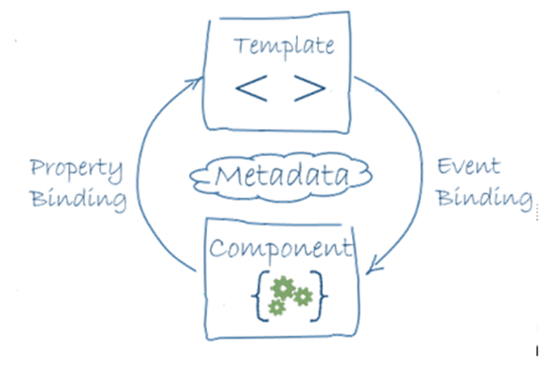
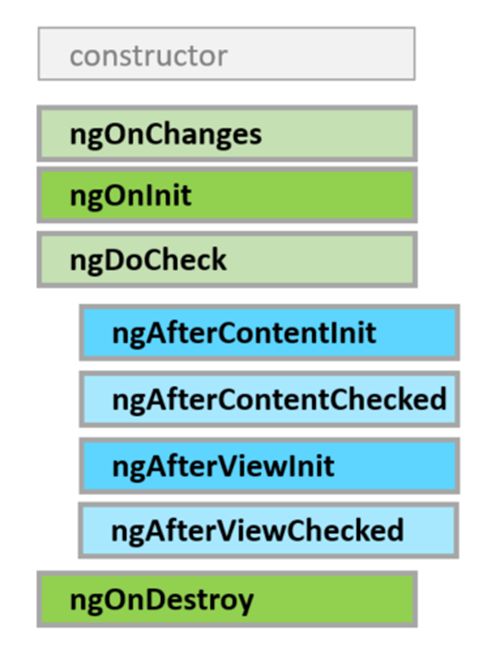

# Angular 20-21

- [Angular 20-21](#angular-20-21)
  - [02. Básico Componentes](#02-básico-componentes)
    - [¿Qué es un Componente?](#qué-es-un-componente)
      - [Creación de un Componente](#creación-de-un-componente)
      - [Decorador @Component](#decorador-component)
      - [Selector](#selector)
      - [Plantillas (templates)](#plantillas-templates)
      - [🧿Usos en el componente Sample](#usos-en-el-componente-sample)
      - [Signals](#signals)
      - [Estilos (styles)](#estilos-styles)
    - [Testing de Componentes](#testing-de-componentes)
      - [Configuración del entorno de test](#configuración-del-entorno-de-test)
      - [Vitest y elementos básicos de los test unitarios](#vitest-y-elementos-básicos-de-los-test-unitarios)
      - [Angular Testing Utilities](#angular-testing-utilities)
        - [TestBed](#testbed)
        - [ComponentFixture](#componentfixture)
        - [DebugElement](#debugelement)
      - [👁️‍🗨️Test básico de un componente: Sample](#️️test-básico-de-un-componente-sample)
      - [Test por defecto con Angular CLI](#test-por-defecto-con-angular-cli)
      - [Coverage (Cobertura de código) y diseño de casos de prueba](#coverage-cobertura-de-código-y-diseño-de-casos-de-prueba)
    - [Scaffolding de Componentes](#scaffolding-de-componentes)
      - [Componentes del core](#componentes-del-core)
        - [🧿Componente Header](#componente-header)
          - [👁️‍🗨️Test del Componente Header](#️️test-del-componente-header)
        - [🧿Componente Footer](#componente-footer)
          - [👁️‍🗨️Test del componente Footer](#️️test-del-componente-footer)
        - [🧿Componente Menu. Proyección de contenido en Header](#componente-menu-proyección-de-contenido-en-header)
        - [🧿Componente Card. Wrappers y proyección de contenido](#componente-card-wrappers-y-proyección-de-contenido)
          - [👁️‍🗨️Tess de los componentes Card](#️️tess-de-los-componentes-card)
        - [🧿Componente Layout. Proyección de contenido multiple](#componente-layout-proyección-de-contenido-multiple)
          - [👁️‍🗨️Tess de los componentes Layout](#️️tess-de-los-componentes-layout)
        - [🧿Componente App](#componente-app)
          - [👁️‍🗨️Test del componente App](#️️test-del-componente-app)
      - [Features y pages](#features-y-pages)
        - [🧿Home Page](#home-page)
          - [👁️‍🗨️Test del componente Home Page](#️️test-del-componente-home-page)
        - [🧿About Page](#about-page)
          - [👁️‍🗨️Test del componente About Page](#️️test-del-componente-about-page)
    - [Lógica del componente y su vista](#lógica-del-componente-y-su-vista)
      - [Data Binding y Event Binding](#data-binding-y-event-binding)
        - [🧿Componente Counter: estado y eventos](#componente-counter-estado-y-eventos)
          - [👁️‍🗨️Test interactivo en Angular: Componente Counter](#️️test-interactivo-en-angular-componente-counter)
      - [Two Way Data Binding](#two-way-data-binding)
        - [🧿Componente Greetings: Two Way Data Binding](#componente-greetings-two-way-data-binding)
          - [👁️‍🗨️Test del componente Greetings](#️️test-del-componente-greetings)
      - [Referencias Locales. Lógica interna de la vista](#referencias-locales-lógica-interna-de-la-vista)
        - [🧿Componente Greeting2 con referencia local](#componente-greeting2-con-referencia-local)
          - [👁️‍🗨️Test del componente Greeting2 con referencia local](#️️test-del-componente-greeting2-con-referencia-local)
    - [Atributos y control flow](#atributos-y-control-flow)
      - [Estilos: clases CSS](#estilos-clases-css)
        - [🧿Componente Counter2: Uso condicional de clases CSS](#componente-counter2-uso-condicional-de-clases-css)
      - [Control de flujo y Renderizado condicional](#control-de-flujo-y-renderizado-condicional)
        - [🧿Limites en el componente Counter2](#limites-en-el-componente-counter2)
          - [👁️‍🗨️Test del componente Counter2](#️️test-del-componente-counter2)
      - [Iteraciones con @for](#iteraciones-con-for)
        - [🧿Componente menú con las opciones como propiedad](#componente-menú-con-las-opciones-como-propiedad)
          - [👁️‍🗨️Test del componente Menu](#️️test-del-componente-menu)
    - [Ciclo de vida de los componentes y accesos a la vista (DOM)](#ciclo-de-vida-de-los-componentes-y-accesos-a-la-vista-dom)
      - [Hooks del ciclo de vida](#hooks-del-ciclo-de-vida)
      - [ViewChild](#viewchild)
        - [🧿Componente Life Cicle y viewChild()](#componente-life-cicle-y-viewchild)
      - [Test Stubs: Mocks y Spies](#test-stubs-mocks-y-spies)
        - [👁️‍🗨️Test del componente Life Cicle](#️️test-del-componente-life-cicle)
    - [Componentes: estado y eventos. Zone v. Zoneless](#componentes-estado-y-eventos-zone-v-zoneless)
      - [Componente CounterNoSignals: estado y eventos](#componente-counternosignals-estado-y-eventos)
      - [Detección del cambio: Zone](#detección-del-cambio-zone)
      - [Zoneless en Angular 20 y 21](#zoneless-en-angular-20-y-21)
      - [Signals de nuevo](#signals-de-nuevo)
      - [Beneficios de Zoneless](#beneficios-de-zoneless)
      - [Cómo habilitar Zoneless en Angular 20 y 21](#cómo-habilitar-zoneless-en-angular-20-y-21)
      - [Estado y asincronía en Zoneless](#estado-y-asincronía-en-zoneless)

## 02. Básico Componentes

En esta segunda parte veremos inicialmente

- las principales funcionalidades de los **componentes**
  - la clase ES y su template
  - el estado y el binding con el template
  - los eventos
  - los nuevos elementos de 'control flow' de Angular 17
  - los estilos CSS
- la creación de proyectos de tipo **librería**
- la **proyección de contenidos** el los componentes
- comenzaremos el tema del **testing** completando los tests de todos los componentes creados hasta ahora
- el cambió de modelo zoned a zoneless
- la importancia de las **Signals** en el nuevo modelo de Angular

### ¿Qué es un Componente?

Un Componente en Angular es una pieza fundamental de la arquitectura de una aplicación Angular. Es una clase que controla una parte específica de la interfaz de usuario (UI) y define cómo se ve y cómo se comporta esa parte. Cada componente está compuesto por tres elementos principales:

1. **Clase TypeScript**: Define la lógica del componente, incluyendo propiedades y métodos que manejan el comportamiento del componente.
2. **Plantilla HTML**: Define la estructura y el contenido visual del componente.
3. **Estilos CSS**: Define la apariencia visual del componente, como colores, fuentes y diseño.

Estas tres partes pueden estar en archivos separados o combinadas en un solo archivo. En la reciente [guía de estilo de Angular](https://angular.dev/style-guide) solo se indica que:

> Components typically consist of one TypeScript file, one template file, and one style file.

Ha dejado de ser obligatorio extraer la plantilla a un archivo HTML si tu componente crece más de tres líneas. Queda abierta a la decisión del desarrollador usar inline template, single-file components (inline templates y styles) o plantillas separadas.

En la guía de estilos se recomienda que los nombres de los componentes ya NO sigan el patrón `nombre-componente.component.ts`, `nombre-componente.component.html` y `nombre-componente.component.css`. Los sufijos “service”, “component”, etc. se consideran redundantes y se recomienda usar nombres más simples como `nombre.ts`, `nombre.html` y `nombre.css`.

Sólo en **módulos** (que no usaremos) y en **pipes** (que veremos más adelante) se recomienda mantener el sufijo para facilitar la identificación del tipo de archivo.

#### Creación de un Componente

Para crear un componente en Angular, se puede utilizar la Angular CLI, que es una herramienta de línea de comandos que facilita la creación y gestión de proyectos Angular. El comando para crear un nuevo componente es:

```bash
ng generate component nombre-del-componente
```

Este comando genera automáticamente los archivos necesarios para el componente. Al menos la clase TypeScript y dependiendo de la configuración del proyecto, puede incluir, la plantilla HTML, los estilos CSS y un archivo de pruebas unitarias.

Esta distribución puede modificarse con las opciones que admite el comando `ng generate component`, como `--inline-template` (`-t`) o `--inline-style` (`-s`) o true o false para incluir o no la plantilla y los estilos en línea dentro del archivo TypeScript del componente.

Igualmente la opción `--skip-tests` (`-S`) permite omitir la creación del archivo de pruebas unitarias.

Creamos un componente de ejemplo llamado `sample` con plantilla y estilos en línea, como hemos definido en la configuración del proyecto:

```bash
ng generate component sample
```

#### Decorador @Component

Para definir un componente en Angular, se utiliza el decorador `@Component`, que es una función que añade metadatos a la clase del componente. Estos metadatos indican a Angular cómo debe procesar, instanciar y utilizar el componente. Aquí hay un ejemplo básico de un componente de Angular en un único fichero:

```typescript
import { Component } from "@angular/core";
@Component({
  selector: "acl-sample",
  template: `
    <h1>Hola, soy un componente de Angular!</h1>
    <p>Este es un ejemplo de un componente básico.</p>
  `,
  styles: [
    `
      h1 {
        color: blue;
      }
      p {
        font-size: 16px;
      }
    `,
  ],
})
export class Sample {
  // Lógica del componente aquí
}
```

En este ejemplo:

- `selector`: Define el nombre del elemento HTML que representará este componente. En este caso, `<app-sample></app-sample>`.
- `template`: Contiene el HTML que define la estructura visual del componente. Aquí se utiliza una plantilla en línea.
- `styles`: Contiene los estilos CSS específicos para este componente, también en línea.
- La clase `Sample` contiene la lógica del componente.

#### Selector

En angular el componente da lugar a un **custom element** en el DOM. Para respetar las convenciones de HTML, los nombres de los selectores deben contener al menos un guion medio, delimitando el prefijo del elemento.

Su valor sera `app` o el prefijo que se haya definido en la configuración del proyecto, mediante la opción --prefix o -p al crear el proyecto con Angular CLI.

#### Plantillas (templates)

Permiten definir la **vista** en función de la información del componente. Así la vista se genera en función de dos elementos principales:

- el **estado del componente**, definido por el valor de los atributos de la clase en un determinado momento
- la plantilla o template que tiene asociado el componente, donde además de HTML puede haber referencia a dichos atributos mediante el lenguaje de plantillas de Angular

La plantilla (template):

- representan el **desarrollo declarativo** en Angular, al expandir las características del HTML, añadiéndole funcionalidades sin necesidad de escribir código JavaScript, que sería el desarrollo imperativo

- Se puede ver como una forma de agregar **valor semántico** al HTML.

El **lenguaje de las plantillas** incluye, además de HTML, diversos elementos propios de Angular, como:

- **{{}}** -> permite **interpolar expresiones** y acceder a las propiedades (variables) y métodos del component

- **[]** -> permite **asignar una propiedad** del componente a cualquier atributo HTML (realmente a las propiedades del DOM)

- **()** -> permite **asignar un método** del componente a cualquier evento de un elemento HTML de la plantilla

- **[()]** -> permite un completo binding de datos (two way binding)

- **\#** -> permite declarar una variable local en la vista, lo que se conoce com **referencia local**

- **@** -> permite invoral recientes mecanismos de control de flujo, incluyendo @if, @for, @switch, @let y otros, que han venido a sustituir a las antiguas directivas estructurales como *ngIf, *ngFor, etc.

- **directivas** -> permiten modificar el comportamiento o la apariencia de los elementos HTML en función de ciertas condiciones o eventos. Pueden ser las que proporciona Angular o directivas personalizadas creadas por el desarrollador.

#### 🧿Usos en el componente Sample

```ts
import { Component } from "@angular/core";
@Component({
  selector: "acl-sample",
  template: `
    <h1>{{ title() }}</h1>
    <p [title]="pTitle()">Este es un ejemplo de un componente básico.</p>
    <p>El valor de la propiedad message es: {{ message() }}</p>
    <button (click)="showAlert()">Haz clic aquí</button>
  `,
  styles: [
    `
      h1 {
        color: blue;
      }
      p {
        font-size: 16px;
      }
    `,
  ],
})
export class Sample {
  protected readonly title = signal("Hola, soy un componente de Angular!");
  protected readonly pTitle = signal("Este es el título del párrafo");
  protected readonly message = signal("¡Hola desde el componente!");

  showAlert() {
    alert("¡Has hecho clic en el botón!");
  }
}
```

De acuerdo con la reciente modificación de la [guía de estilo de Angular](https://angular.dev/style-guide), el método manejador (handler) del evento no se nombra en función del momento en el que se invocan añadiendo el prefijo `on`, sino por la acción que realiza. En nuestro caso se ha usado simplemente `showAlert()` en lugar de `onClick()`.

#### Signals

Angular ha introducido el concepto de **Signals** como una forma de gestionar el estado reactivo dentro de los componentes. Una Signal es un objeto que representa un valor que puede cambiar con el tiempo y notifica automáticamente a los componentes que dependen de él cuando ese valor cambia.

En la práctica, una signal es una variable especial que puede notificar a Angular cuando su valor cambia, lo que permite que la interfaz de usuario se actualice automáticamente en respuesta a esos cambios sin necesidad de usar Zone.js.

Para usar Signals en Angular, debes importar las funciones necesarias desde `@angular/core`:

```ts
import { Component, signal } from "@angular/core";
```

Como vemos en el componente ejemplo,

- las propiedades `title` y `mensaje` se definen como signals utilizando la función `signal()`.
- Cuando el valor de un signal cambia, Angular detecta ese cambio y actualiza automáticamente cualquier parte de la plantilla que dependa de ese signal.
- para utilizar el valor de un signal en la plantilla, se llama como una función, por ejemplo, `{{ mensaje() }}`.

Más adelante veremos con más detalle el uso de signals en Angular.

#### Estilos (styles)

- permiten definir la apariencia visual del componente mediante **CSS** o alguno de sus **pre-procesadores** (Sass o Less)

- los estilos definidos en un componente son **scoped** (aislados) al propio componente, evitando que afecten a otros componentes de la aplicación

Existen diferentes niveles de encapsulación del CSS del componente

- Se definen en el metadato encapsulation

```ts
import { Component, ViewEncapsulation } from "@angular/core";
@Component({
  selector: "app-sample",
  templateUrl: "./sample.html",
  styleUrls: ["./sample.css"],
  encapsulation: ViewEncapsulation.Emulated,
})
export class Sample {
  // Lógica del componente aquí
}
```

- Sus posibles valores corresponden al enum ViewEncapsulation, que incluye tres valores
  - **None** - sin encapsulación, los estilos afectan a toda la aplicación
  - **Emulated** - encapsulación emulada (valor por defecto)
  - **ShadowDom** - usando ShadowDOM nativo del navegador

El valor por defecto, Emulated:

- crea un conjunto de atributos que luego incorpora al CSS para limitar los efectos del CSS al elemento en el que se crea, simulando así el comportamiento del ShadowDOM
- no evita que los CSS definidos fuera afecten al componente
- tradicionalmente no tenía el problema de la incompleta implementación de ShadowDOM en los navegadores

En el CSS de angular existe un pseudo-elemento especial `:host`, que permite aplicar estilos al elemento host del componente desde el propio CSS del componente. Por ejemplo:

```css
:host {
  display: block;
  border: 1px solid #ccc;
  padding: 10px;
  margin: 10px 0;
}
```

### Testing de Componentes

#### Configuración del entorno de test

Angular incluye un entorno de pruebas ya configurado por defecto, que permite crear y ejecutar tests unitarios para los componentes y otros elementos de la aplicación.

HAsta la versión 20 de Angular, el entorno de pruebas se basaba en Jasmine y Karma, pero a partir de Angular 21 se ha adoptado [Vitest](https://vitest.dev/) como framework de pruebas por defecto.

De esta forma, el entorno de pruebas incluye:

- Vitest como framework de pruebas
- jsdom como entorno de ejecución simulado del DOM
- Angular Testing Utilities (@angular/core/testing) para facilitar la configuración y ejecución de tests

Una alternativa a esto último sería la [Testing Library](https://testing-library.com/) para Angular como biblioteca de utilidades para pruebas de componentes.

#### Vitest y elementos básicos de los test unitarios

Como framework de test Vitest ofrece una serie de características que facilitan la escritura y ejecución de pruebas unitarias en Angular.

Su sintaxis es compatible con Jest y similar a Jasmine lo que facilita la transición para los desarrolladores familiarizados con este último framework.

En todos los casos los tests se escriben en archivos con extensión `.spec.ts` o `.test.ts` y se localizan a lo largo del proyecto, en la carpeta del componente que prueban.

También comparten todos ellos los elementos básicos de los test unitarios:

- **Test suite**: Es un conjunto de test unitarios que se agrupan en una estructura jerárquica. En una test suite se pueden agrupar los test unitarios por funcionalidad, por módulo o por cualquier otro criterio que se considere adecuado. Para definir una test suite se utiliza la función `describe`.

- **Test unitario**: Es una prueba que se realiza sobre una unidad de código, como una función o una clase, de forma aislada. Un test unitario debe ser independiente de otros test y no debe depender de la ejecución de otros test. Para definir un test unitario se utiliza la función `it` o `test`.

- **Aserción**: Es una expresión que se evalúa para verificar que el resultado de un test es el esperado. En JavaScript, las aserciones se realizan utilizando la función `expect` de la librería de aserciones que estemos utilizando. Para comprobar la validez de una aserción, se utilizan una seria de funciones booleanas que se encargan de comparar el valor esperado con el valor obtenido. Una de las funciones más comunes para realizar aserciones es la función `toBe`.

- **Setup y teardown**: Son funciones que se ejecutan antes y después de cada test unitario. En estas funciones se pueden realizar tareas de inicialización y limpieza que sean necesarias para la ejecución del test. Se definen utilizando las funciones

- `beforeEach`
- `afterEach`
- `beforeAll`
- `afterAll`

Estas funciones se conocen como **hooks** porque se ejecutan automáticamente en momentos concretos del ciclo de vida de un test.

#### Angular Testing Utilities

Angular Testing Utilities es un conjunto de herramientas que facilitan la creación y ejecución de pruebas unitarias para componentes y otros elementos de Angular.

Proporciona una serie de funciones y clases que permiten crear un entorno de pruebas simulado para los componentes, incluyendo la creación de instancias de componentes, la simulación de eventos y la verificación del estado del DOM.

##### TestBed

El TestBed es una clase que proporciona un entorno de pruebas simulado para los componentes de Angular. Permite crear instancias de componentes, servicios y otros elementos de Angular, y configurar el entorno de pruebas para que se asemeje al entorno de ejecución real de la aplicación.

Para utilizar el TestBed, es necesario importarlo desde el módulo `@angular/core/testing`. Una vez importado, se puede utilizar para configurar el entorno de pruebas y crear instancias de componentes y otros elementos de Angular.

```ts
import { TestBed } from "@angular/core/testing";

beforeEach(() => {
  TestBed.configureTestingModule({
    declarations: [MyComponent],
    imports: [MyModule],
    providers: [MyService],
  });
});
```

La función `configureTestingModule` permite configurar el entorno de pruebas, incluyendo la declaración de componentes, la importación de módulos y la provisión de servicios. Gracias a ello, se pueden crear instancias de componentes y otros elementos de Angular en el entorno de pruebas simulado.

##### ComponentFixture

El ComponentFixture es una clase que proporciona una interfaz para interactuar con un componente en el entorno de pruebas simulado. Permite acceder a la instancia del componente, al DOM asociado y a otros elementos relacionados con el componente.

```ts
let fixture = TestBed.createComponent(MyComponent);
let component = fixture.componentInstance;
```

La función `createComponent` permite crear una instancia de la **fixture**, que a su vez contiene la instancia del componente y el DOM asociado. Con la fixture, se puede:

- acceder a la instancia del componente para realizar pruebas unitarias orientadas a la implementación de la lógica del componente, accediendo a sus propiedades y métodos

- acceder al DOM asociado para realizar pruebas unitarias orientadas a la interfaz de usuario del componente, verificar su comportamiento en respuesta a las interacciones del usuario.

##### DebugElement

El DebugElement es una clase que proporciona una interfaz para interactuar con los elementos del DOM en el entorno de pruebas simulado. Permite acceder a los elementos del DOM, sus propiedades y atributos, y simular eventos.

Es una alternativa al uso directo de los selectores del DOM, como `querySelector` o `getElementById`, y proporciona una forma más segura y eficiente de interactuar con los elementos del DOM en el entorno de pruebas.

DebugElement proporciona, entre otras propiedades y métodos:

- `nativeElement`: Permite acceder al elemento nativo del DOM asociado al DebugElement.
- `query`: Permite buscar un elemento del DOM utilizando un selector CSS.
- `queryAll`: Permite buscar todos los elementos del DOM que coinciden con un selector CSS.
- `triggerEventHandler`: Permite simular un evento en el elemento del DOM asociado al DebugElement.

Para las búsquedas de elementos en el DOM, DebugElement utiliza la clase `By` del módulo `@angular/platform-browser`, que proporciona una serie de métodos para buscar elementos utilizando selectores CSS, directivas y otros criterios.

#### 👁️‍🗨️Test básico de un componente: Sample

Tomando como ejemplo nuestro componente Sample, podemos crear un test básico para verificar que se crea correctamente y que muestra el título esperado.

```ts
import { Component } from "@angular/core";
@Component({
  selector: "acl-sample",
  template: `
    <h1>{{ title() }}</h1>
    <p [title]="pTitle()">Este es un ejemplo de un componente básico.</p>
    <p>El valor de la propiedad message es: {{ message() }}</p>
    <button (click)="showAlert()">Haz clic aquí</button>
  `,
})
export class Sample {
  protected readonly title = signal("Hola, soy un componente de Angular!");
  protected readonly pTitle = signal("Este es el título del párrafo");
  protected readonly message = signal("¡Hola desde el componente!");
```

En la preparación del test, se crea una instancia del TestBed y se configura el entorno de pruebas para incluir el componente Sample.

```ts
describe("Sample", () => {
  let component: Sample;
  let fixture: ComponentFixture<Sample>;
  let debugElement: DebugElement;

  beforeEach(async () => {
    await TestBed.configureTestingModule({
      imports: [Sample],
    }).compileComponents();

    fixture = TestBed.createComponent(Sample);
    component = fixture.componentInstance;
    await fixture.whenStable();
    debugElement = fixture.debugElement;
  });

  // tests aquí
});
```

En el primer test, se verifica que el componente se crea correctamente con determinadas propiedades, como ejemplo del enfoque orientado a la implementación.

```ts
it("should create", () => {
  expect(component).toBeTruthy();
  expect(component["title"]()).toContain("Angular");
  expect(component["message"]()).toContain("componente");
});
```

En el segundo test, se verifica que el título se muestra correctamente en la vista, como ejemplo del enfoque orientado a la interfaz de usuario.

```ts
it("should render title", async () => {
  await fixture.whenStable();
  const elementH1 = debugElement.query(By.css("h1"))
    .nativeElement as HTMLHeadingElement;
  expect(elementH1.textContent).toContain("Angular");
  const eParagraph = debugElement.queryAll(By.css("p"))[0]
    .nativeElement as HTMLParagraphElement;
  expect(eParagraph.textContent).toContain("componente");
});
```

Los dos tes comprueban lo mismo, pero desde enfoques diferentes: la implementación del componente y su interfaz de usuario.

Esta es una diferencia con la Testing library y su enfoque exclusivamente orientado a la interfaz de usuario.

#### Test por defecto con Angular CLI

Si comprobamos los tests generados por defecto al crear un componente con el CLI de Angular, veremos que siguen el mismo patrón que el test básico que hemos visto.

En cuanto a aserciones, se limitan a comprobar que el componente se crea correctamente.

El único ejemplo creado con más comprobaciones en el test de AppComponent, que verifica que el título se muestra correctamente en la vista.

En los demás componentes, los test iniciales pueden considerarse test "de humo" (smoke tests), que se limitan a comprobar que el componente se crea correctamente y sin embargo dan un coverage incluso del 100%, con una falsa sensación de seguridad, aunque en realidad no se ha probado ninguna funcionalidad.

Para nuestros componentes del core, podemos modificar estos test básicos, limitándonos a comprobar como se renderizan en la vista los detalles de cada componente.

#### Coverage (Cobertura de código) y diseño de casos de prueba

El coverage o cobertura de código es una métrica que nos indica el porcentaje de código que está cubierto por los test. El objetivo del coverage es asegurarnos de que todos los caminos de ejecución de nuestro código están cubiertos por los test, es decir que han sido ejecutadas todas las líneas de código y todas las ramas de decisión.

El coverage se mide en porcentaje y se calcula dividiendo el número de líneas de código que han sido ejecutadas por los test entre el número total de líneas de código del programa. Un coverage del 100% significa que todas las líneas de código han sido ejecutadas por los test.

El coverage es una métrica muy útil para evaluar la calidad de los test y para identificar las partes del código que no están cubiertas por los test. Sin embargo, aunque puede entenderse como condición necesaria, un coverage del 100% no es suficiente para garantizar la calidad del software porque puede haber casos de uso que no se hayan contemplado.

Para obtener el coverage de nuestro proyecto Angular, podemos utilizar el comando:

```shell
ng test --coverage
```

O crear un script en el package.json:

```json
"scripts": {
  "test:c": "ng test --coverage"
}
```

En la actual version de Angular, el informe de coverage NO se genera correctamente.

### Scaffolding de Componentes

Se conoce como scaffolding la estructura de archivos y carpetas en las que se distribuyen los componentes y demás elementos de una aplicación Angular.

Esta estructura no condiciona las relaciones entre los elementos ni tiene ningún efecto en la ejecución de la aplicación, como sucedía anteriormente con los módulos, pero facilita la organización y el mantenimiento del código.

Es frecuente organizar los componentes en carpetas que reflejen su funcionalidad o características comunes, como:

- **feature**: componentes relacionados con una funcionalidad específica de la aplicación
- **core**: componentes y servicios esenciales para el funcionamiento de la aplicación

En cada uno de ellos se pueden crear subcarpetas para agrupar elementos de distinto tipo, como:

- **components**: para componentes reutilizables
- **services**: para servicios
- **models**: para modelos de datos
- **pipes**: para pipes personalizados
- **directives**: para directivas personalizadas

El componente que representa una la vista principal de una funcionalidad (la página) puede ir directamente en la carpeta de la funcionalidad, mientras que los componentes secundarios (hijos) pueden ir en la subcarpeta components.

#### Componentes del core

- header
- footer
- menu
- main

```shell
ng g c core/components/header
ng g c core/components/footer
ng g c core/components/menu
ng g c core/components/main
```

##### 🧿Componente Header

```ts
@Component({
  selector: "alc-header",
  template: `
    <header class="container">
      <div>
        <h1>{{ title() }}</h1>
        <p>{{ subtitle() }}</p>
      </div>
      <div>
        
      </div>
    </header>
  `,
  styles: [
    `
      :host {
        display: block;
        border-bottom: 2px solid #343a40;
        margin-bottom: 1.5rem;
        min-height: 15vh;
      }
    `,
    `
      header {
        height: 100%;
        background-color: #f8f9fa;
        padding: 1rem 2rem;
        text-align: center;
        display: grid;
        grid-template-columns: 1fr auto;
        align-items: center;
        h1 {
          margin: 0;
          color: #343a40;
        }
      }
    `,
  ],
})
export class Header {
  protected readonly title = signal("Curso de Angular 21");
  protected readonly subtitle = signal(
    "Aprende a desarrollar aplicaciones con Angular"
  );
}
```

###### 👁️‍🗨️Test del Componente Header

Tomando como ejemplo nuestro componente Header, podemos crear un test básico para verificar que se crea correctamente y que muestra el título esperado.

Como sabemos, en la preparación del test, se crea una instancia del TestBed y se configura el entorno de pruebas para incluir el componente Header.

```ts
describe("Header", () => {
  let component: Header;
  let fixture: ComponentFixture<Header>;
  let debugElement: DebugElement;

  beforeEach(async () => {
    await TestBed.configureTestingModule({
      imports: [Header],
    }).compileComponents();

    fixture = TestBed.createComponent(Header);
    component = fixture.componentInstance;
    await fixture.whenStable();
    debugElement = fixture.debugElement;
  });

  // tests aquí
});
```

En el primer test, se verifica que el componente se crea correctamente con determinadas propiedades, como ejemplo del enfoque orientado a la implementación.

```ts
it("should create", () => {
  expect(component).toBeTruthy();
  expect(component["title"]()).toContain("Angular");
  expect(component["subtitle"]()).toContain("Aprende");
});
```

En el segundo test, se verifica que el título se muestra correctamente en la vista, como ejemplo del enfoque orientado a la interfaz de usuario.

```ts
it("should render title", async () => {
  await fixture.whenStable();
  const elementH1 = debugElement.query(By.css("h1"))
    .nativeElement as HTMLHeadingElement;
  const eParagraph = debugElement.query(By.css("p"))
    .nativeElement as HTMLParagraphElement;
  expect(elementH1.textContent).toContain("Angular");
  expect(eParagraph.textContent).toContain("Aprende");
});
```

Los dos tes comprueban lo mismo, pero desde enfoques diferentes: la implementación del componente y su interfaz de usuario.

Esta es una diferencia con la Testing library y su enfoque exclusivamente orientado a la interfaz de usuario.

##### 🧿Componente Footer

```ts
@Component({
  selector: "alc-footer",
  template: `
    <footer>
      <address>
        <p>{{ autor() }}</p>
        <p>{{ brand() }}</p>
        <p>{{ today().getFullYear() }}</p>
      </address>
    </footer>
  `,
  styles: `
    :host {
      display: flex;
      justify-content: center;
      align-items: center;
      border-top: 2px solid #343a40;
      margin-top: 1.5rem;
      min-height: 10vh;
    }
    footer {
     text-align: center;

    }
    address {
      font-style: normal;
    }
    `,
})
export class Footer {
  protected readonly autor = signal("Alejandro Cerezo");
  protected readonly brand = signal("ICONO Training for Indra");
  protected readonly today = signal(new Date());
}
```

###### 👁️‍🗨️Test del componente Footer

Aunque ya tiene un 100% de coverage, deberíamos testar ue renderiza realmente lo esperado.

- Añadimos el debugElement a partir de la fixture
- Buscamos él con el selector de la etiqueta p
- Nos quedamos con los correspondientes nativeElement
- Comprobamos que contienen cada uno el texto esperado, que hemos obtenido de las propiedades del componente

```ts
  it('should render a address with 3 paragraphs', () => {
    const autor = component['autor']();
    const brand = component['brand']();

    const today = 2000
    component['today'].set(new Date('2000-01-01'));
    fixture.detectChanges();

    const addressElement: HTMLElement = debugElement.query(By.css('address')).nativeElement;
    expect(addressElement).toBeTruthy();
    const pElements: HTMLParagraphElement[] = debugElement
      .queryAll(By.css('p'))
      .map((de) => de.nativeElement);
    expect(pElements[0].textContent).toEqual(autor);
    expect(pElements[1].textContent).toEqual(brand);
    expect(pElements[2].textContent).toEqual(today.toString());
  });
});
```

Opcionalmente, como hacemos con la fecha, podemos redefinir las propiedades del componente (asignarles un valor mock) para comprobar que se renderizan correctamente en la vista.

En ese caso, al modificar nosotros el estado del componente, debemos lanzar **fixture.detectChanges()** para que la vista se actualice con los nuevos valores. Esto se debe a que en los tests de Angular no se produce la detección automática de cambios como en la ejecución normal de la aplicación.

##### 🧿Componente Menu. Proyección de contenido en Header

De momento el componente menu se limita a presentar un mensaje de que montara un menu de navegación.

```ts
import { Component } from "@angular/core";

@Component({
  selector: "alc-menu",
  template: ` <p>aquí va el menú</p> `,
  styles: ``,
})
export class Menu {}
```

Siguiendo los estándares de HTML, al incluir un elemento `<nav>` en la plantilla del componente, se mejora la semántica del documento y se facilita la accesibilidad para los usuarios y dispositivos que utilizan tecnologías asistivas.

```ts
import { Component } from "@angular/core";
@Component({
  selector: "alc-menu",
  template: ` <nav>aquí va el menú</nav> `,
  styles: ``,
})
export class Menu {}
```

En la misma línea, sería recomendable que formara parte del header de nuestro html, que entre otras cosas debe incluir los elementos de navegación principales de la aplicación. Para ello, podríamos incluir el componente menu dentro del componente header, modificando su plantilla para que incluya el menú de navegación. Otra opción sería utilizar **proyección de contenido** (ng-content) para permitir que el menú se inserte dinámicamente en el header desde el componente padre (app.component.html).

- El contenido incluido entre la apertura y el cierre de una componente Angular puede ser recogido por el componente
- Para ello se utiliza el elemento ng-content en el template del componente indicando donde se inserta el contenido \<ng-content></ng-content>
- Opcionalmente, el atributo `select=""` del elemento permite indicar el selector del contenido que se debe insertar en cada bloque ng-content, Se puede usar el selector del componente (no deja de ser una etiqueta HTML), una clase un id o cualquier selector CSS válido.

El **componente header** podría quedar así:

```ts
import { Component } from '@angular/core';

@Component({
  selector: 'alc-header',
  template: `
    <header class="container">
      <div>
        <h1>{{ title }}</h1>
        <p>{{ subtitle }}</p>
      </div>
      <div>
        
      </div>
      <ng-content></ng-content>
    </header>
  `,
  styles: [...],
})
```

En el componente App podríamos incluir el menú dentro del header así:

```html
<alc-header>
  <alc-menu></alc-menu>
</alc-header>
```

##### 🧿Componente Card. Wrappers y proyección de contenido

La proyección de contenido, como técnica que permite insertar contenido dinámico en un componente Angular desde su componente padre, permite crear componentes wrapper o contenedores. Su función es envolver otros componentes o elementos HTML, proporcionando una estructura común y un estilo consistente. En ellos cobra
especial importancia el css.

Un ejemplo típico de componente wrapper es una **tarjeta** (card), que puede envolver cualquier contenido, proporcionando un diseño y estilo uniforme.

```ts
import { Component } from "@angular/core";

@Component({
  selector: "alc-card",
  imports: [],
  template: ` <ng-content></ng-content> `,
  styles: `
    :host {
      display: block;
      margin: 1rem 0;
      padding: 1rem;
      border: 1px solid #ccc;
      border-radius: 8px;
      box-shadow: 2px 2px 6px rgba(0, 0, 0, 0.1);
      text-align: center;
    }
  `,
})
export class Card {}
```

###### 👁️‍🗨️Tess de los componentes Card

Para testar un componente que recibe contenido proyectado (ng-content), como Layout o Card, necesitamos crear en el test un componente Host, que renderice nuestro componente pasándole algún contenido.

```ts
const TEXT = "Hello World";

@Component({
  imports: [Card],
  template: `<alc-card> {{ text }} </alc-card>`,
})
class TestHostComponent {
  protected readonly text = TEXT;
}
```

A continuación testamos el componente Host, creando su fixture y accedemos al debugElement del componente Card para comprobar que renderiza el contenido proyectado correctamente.

```ts
describe("Card", () => {
  let component: TestHostComponent;
  let fixture: ComponentFixture<TestHostComponent>;
  let debugElement: DebugElement;

  beforeEach(async () => {
    await TestBed.configureTestingModule({
      imports: [TestHostComponent],
    }).compileComponents();

    fixture = TestBed.createComponent(TestHostComponent);
    component = fixture.componentInstance;
    await fixture.whenStable();
    debugElement = fixture.debugElement;
  });

  it("should create", () => {
    expect(component).toBeTruthy();
    const cardElement: HTMLElement = debugElement.query(
      By.directive(Card)
    ).nativeElement;
    expect(cardElement).toBeTruthy();
    expect(cardElement.textContent).toContain(TEXT);
  });
});
```

##### 🧿Componente Layout. Proyección de contenido multiple

Ampliando el uso de la proyección de contenido, podemos incluir varios elementos proyectándolos en diferentes sitios y en varios niveles

Desde App le pasamos a layout el menú y el router-outlet

```html
<alc-layout class="layout">
  <alc-menu class="main-menu" />
  <router-outlet />
</alc-layout>
```

En layout organizamos los elementos de la estructura de las páginas, proyectando el menú en el header y el resto del contenido en el main (etiqueta HTML5 para el contenido principal de la página)

```ts
import { Component } from "@angular/core";
import { Header } from "../header/header";
import { Footer } from "../footer/footer";

@Component({
  selector: "alc-layout",
  imports: [Header, Footer],
  template: `
    <alc-header>
      <ng-content select=".main-menu"></ng-content>
    </alc-header>
    <main class="container">
      <ng-content></ng-content>
    </main>
    <alc-footer />
  `,
  styles: `
    main {
      padding: 1rem 2rem;
      `,
})
export class Layout {}
```

###### 👁️‍🗨️Tess de los componentes Layout

El componte Layout es similar al Card, pero con dos áreas de contenido proyectado (ng-content select). Ademas renderiza dos componentes hijos: Header y Footer. Su test se convierte en cierto modo en un test de integración.

De nuevo necesitamos un componente Host para renderizar el Layout con contenido proyectado en sus dos áreas.

```ts
const TEXT = "Hello World";
const MAIN_MENU = "main-menu";

@Component({
  imports: [Layout],
  template: `<alc-layout>
    <div class="main-menu">{{ menu }}</div>
    {{ text }}
  </alc-layout>`,
})
class TestHostComponent {
  protected readonly text = TEXT;
  protected readonly menu = MAIN_MENU;
}
```

Y en el test comprobamos que se renderiza correctamente el contenido proyectado en ambas áreas, así como los componentes hijos Header y Footer.

```ts
describe("Layout", () => {
  let component: TestHostComponent;
  let fixture: ComponentFixture<TestHostComponent>;
  let debugElement: DebugElement;

  beforeEach(async () => {
    await TestBed.configureTestingModule({
      imports: [TestHostComponent],
    }).compileComponents();

    fixture = TestBed.createComponent(TestHostComponent);
    component = fixture.componentInstance;
    await fixture.whenStable();
    debugElement = fixture.debugElement;
  });

  it("should create", () => {
    expect(component).toBeTruthy();
    const layoutElement: HTMLElement = debugElement.query(
      By.directive(Layout)
    ).nativeElement;
    expect(layoutElement).toBeTruthy();
    expect(layoutElement.textContent).toContain(TEXT);
    const headerElement: HTMLElement = debugElement.query(
      By.directive(Header)
    ).nativeElement;
    expect(headerElement).toBeTruthy();
    expect(headerElement.textContent).toContain(MAIN_MENU);
    const footerElement: HTMLElement = debugElement.query(
      By.directive(Footer)
    ).nativeElement;
    expect(footerElement).toBeTruthy();
  });
});
```

##### 🧿Componente App

Finalmente el componente App usa el layout para organizar la estructura de la aplicación y quedaría así:

```ts
@Component({
  selector: "alc-root",
  imports: [RouterOutlet, Layout, Menu],
  template: `
    <alc-layout class="layout">
      <alc-menu class="main-menu" />
      <router-outlet />
      <p>Aquí irá cada página</p>
    </alc-layout>
  `,
  styles: `
    .layout {
      display: grid;
      grid-template-rows: auto 1fr auto;

      min-height: 100vh;

      font-family: Arial, sans-serif;
      margin: 0;
      padding: 0;
      }`,
})
export class App {
  protected readonly title = signal("demo1");
}
```

###### 👁️‍🗨️Test del componente App

Al haber quedado como un contenedor de otros componentes, el test del componente App se convierte en un test de integración, que comprueba la presencia del Layout, Menu y RouterOutlet en su plantilla.

```ts
describe("App", () => {
  let component: App;
  let fixture: ComponentFixture<App>;
  let debugElement: DebugElement;

  beforeEach(async () => {
    await TestBed.configureTestingModule({
      imports: [App],
    }).compileComponents();

    fixture = TestBed.createComponent(App);
    component = fixture.componentInstance;
    await fixture.whenStable();
    debugElement = fixture.debugElement;
  });

  it("should create the app", () => {
    expect(component).toBeTruthy();
  });

  it("should render children components", async () => {
    const layoutElement: HTMLElement = debugElement.query(
      By.directive(Layout)
    ).nativeElement;
    expect(layoutElement).toBeTruthy();
    const menuElement: HTMLElement = debugElement.query(
      By.directive(Menu)
    ).nativeElement;
    expect(menuElement).toBeTruthy();
    const routerOutlet = debugElement.query(
      By.directive(RouterOutlet)
    ).nativeElement;
    expect(routerOutlet).toBeTruthy();
  });
});
```

#### Features y pages

En la carpeta features se pueden crear subcarpetas para cada una de las funcionalidades principales de la aplicación, y dentro de ellas los componentes que representan las páginas (views) y los componentes secundarios (children).

NO existen como tal las páginas
Podemos llamar así a los componentes invocados directamente en las rutas y usarlos como contenedores

Desde el cli le podemos indicar la ruta completa y el nombre de la pagina para crear el componente en la ubicación deseada, usando el modificador --flat para evitar que se cree una subcarpeta con el nombre del componente.:

```shell
ng g c features/home/home-page --flat
ng g c features/about/about-page --flat
```

Opcionalmente, se puede añadir el modificador --skip-selector para evitar que se genere el selector del componente, que no es necesario en las páginas, ya que serán accedida como ruta y en ningún caso consumida desde otro template

```shell
ng g c pages/home -t -s --skip-selector
ng g c pages/about  -t -s --skip-selector
```

Sin embargo suele mantenerse el selector para facilitar la identificación del componente en el DOM.

Para facilitar posteriormente su uso en las rutas, las páginas se exportan como default, y este cambio se recoge en sus test para evitar que den error.

Por el momento cargamos de forma estática la página home a continuación del router-outlet del componente App.

##### 🧿Home Page

```ts
import { Component } from "@angular/core";

@Component({
  selector: "alc-home-page",
  imports: [],
  template: ` <h2>Home</h2> `,
  styles: ``,
})
export default class HomePage {}
```

###### 👁️‍🗨️Test del componente Home Page

Por el momento la página solo incluye un título, por lo que el test se limita a comprobar que se crea correctamente y que el título se muestra en la vista.

```ts
describe("HomePage", () => {
  let component: HomePage;
  let fixture: ComponentFixture<HomePage>;
  let debugElement: DebugElement;

  beforeEach(async () => {
    await TestBed.configureTestingModule({
      imports: [HomePage],
    }).compileComponents();

    fixture = TestBed.createComponent(HomePage);
    component = fixture.componentInstance;
    await fixture.whenStable();
    debugElement = fixture.debugElement;
  });

  it("should create", () => {
    expect(component).toBeTruthy();
  });

  it("should render the title", () => {
    const h2Element: HTMLHeadingElement = debugElement.query(
      By.css("h2")
    ).nativeElement;
    expect(h2Element.textContent).toContain("Home");
  });
});
```

##### 🧿About Page

```ts
import { Component } from "@angular/core";

@Component({
  selector: "alc-about-page",
  imports: [],
  template: ` <h2>About Us</h2> `,
  styles: ``,
})
export default class AboutPage {}
```

###### 👁️‍🗨️Test del componente About Page

Igual que en el caso anterior, la página solo incluye un título, por lo que el test se limita a comprobar que se crea correctamente y que el título se muestra en la vista.

```ts
describe("AboutPage", () => {
  let component: AboutPage;
  let fixture: ComponentFixture<AboutPage>;
  let debugElement: DebugElement;

  beforeEach(async () => {
    await TestBed.configureTestingModule({
      imports: [AboutPage],
    }).compileComponents();

    fixture = TestBed.createComponent(AboutPage);
    component = fixture.componentInstance;
    await fixture.whenStable();
    debugElement = fixture.debugElement;
  });

  it("should create", () => {
    expect(component).toBeTruthy();
  });

  it("should render the title", () => {
    const h2Element: HTMLHeadingElement = debugElement.query(
      By.css("h2")
    ).nativeElement;
    expect(h2Element.textContent).toContain("About");
  });
});
```

### Lógica del componente y su vista



Angular permite una relación bidireccional entre la lógica del componente (clase TypeScript) y su vista (plantilla HTML) mediante un mecanismo específico para cada dirección de la comunicación:

- Desde el componente hacia la vista: **data binding**
- Desde la vista hacia el componente: **event bindings**

#### Data Binding y Event Binding

El **data binding** permite que los datos fluyan desde el componente hacia la vista

- angular permite manipular las propiedades del DOM, aunque aparentemente haga referencia a los atributos HTML
- este acceso a las propiedades (Input Property Binding) utiliza el formato [<atributo/propiedad>]="<expresión>"
- en la misma dirección esta la posibilidad de interpolar expresiones en la plantilla usando 
- hasta ahora el mecanismo permitía cambiar los valores pero no conocer cuando se producen esos cambios
- con el uso de signals, angular puede detectar los cambios en las propiedades del componente y actualizar automáticamente la vista cuando sea necesario

Los **event bindings** permiten a la vista informar de los cambios que se producen (e.g. interacciones del usuario) al componente

- los eventos generados en la vista sean manejados por el componente
- el operador () indicando dentro el evento, permite definir el manejador de cualquier evento estándar para un determinado elemento del DOM
- el manejador es un método definido en la clase del componente que se ejecuta cuando se produce el evento: <form (submit)="onSubmit()"></form>
- aunque es un callback y que angular se encarga de invocarlo cuando se produce el evento, se include en la plantilla CON paréntesis
- esto facilita el paso de cualquier parámetro al manejador, incluyendo el propio evento ($event) del tipo Event estándar de JavaScript

##### 🧿Componente Counter: estado y eventos

Creamos un componente contador y lo añadimos en la página home

```shell
  ng g c features/home/components/counter
```

Añadimos el componente en la home-page

````htm
- Cualquier propiedad de la clase es en si un estado: sus cambios se reflejan en
la vista - En la vista podemos definir la respuesta a los eventos con el
operador () - En esa respuesta podemos hacer directamente cambios en el estado,
que automáticamente actualizaran la vista ```html
<alc-card>
  <h3>Contador de clicks</h3>
  <button
    type="button"
    (click)="counter.set(counter() - 1)"
    title="Decrementar 1"
  >
    ➖
  </button>
  <output>{{ counter() }}</output>
  <button
    type="button"
    (click)="counter.set(counter() + 1)"
    title="Incrementar 1"
  >
    ➕
  </button>
  <button type="button" (click)="counter.set(0)" title=""Reiniciar contador">🔄</button>
</alc-card>
````

Sería mucho mejor práctica llevar la lógica a un método manejador del evento click

```ts
  updateCounter(value: number) {
    this.counter.set(this.counter() + value);
  }
```

Con lo que el template quedaría así:

```ts
import { Component, signal } from "@angular/core";
import { Card } from "../../../../core/components/card/card";

@Component({
  selector: "alc-counter",
  imports: [Card],
  template: `
    <alc-card>
      <h3>Contador de clicks</h3>
      <button type="button" (click)="updateCounter(-1)" title="Decrementar 1">
        ➖
      </button>
      <output>{{ counter() }}</output>
      <button type="button" (click)="updateCounter(1)" title="Incrementar 1">
        ➕
      </button>
      <button
        type="button"
        (click)="updateCounter(0)"
        title="Reiniciar contador"
      >
        🔄
      </button>
    </alc-card>
  `,
  styles: `
  output {
    margin: 0 1rem;
    font-size: 1.5rem;
    font-weight: bold;
  }`,
})
export class Counter {
  protected counter = signal(0);

  updateCounter(value: number) {
    if (value === 0) {
      this.counter.set(0);
    } else {
      this.counter.set(this.counter() + value);
    }
  }
}
```

###### 👁️‍🗨️Test interactivo en Angular: Componente Counter

Como tenemos botones, debemos comprobar su funcionalidad.

El debugElement dispone para es del método triggerEventHandler() para disparar el click del botón.
Después de usarlo es importante lanzar **fixture.detectChanges()** para que la vista refleje los cambios en el componente. El proceso de detección del cambio automático en los componentes de Angular no lo es en el entorno de test, por lo que hay que ejecutar el correspondiente método de la fixture

```ts
describe("When we use the buttons", () => {
  let outputElement: HTMLSpanElement;
  let buttonDebugElements: DebugElement[];
  beforeEach(() => {
    outputElement = debugElement.query(By.css("output")).nativeElement;
    buttonDebugElements = debugElement.queryAll(By.css("button"));
  });

  it("should increase the display when the button + is clicked", () => {
    component["counter"].set(0);
    buttonDebugElements[1].triggerEventHandler("click");
    fixture.detectChanges();
    expect(outputElement.textContent).toBe("1");
  });

  it("should increase the display when the button + is clicked", () => {
    component["counter"].set(0);
    buttonDebugElements[0].triggerEventHandler("click");
    fixture.detectChanges();
    expect(outputElement.textContent).toBe("-1");
  });

  it("should reset the display when the button 🔄 is clicked", () => {
    component["counter"].set(5);
    buttonDebugElements[2].triggerEventHandler("click");
    fixture.detectChanges();
    expect(outputElement.textContent).toBe("0");
  });
});
```

#### Two Way Data Binding

Una de las propiedades más características de Angular es su capacidad para facilitar el **two-way data binding** o enlace bidireccional de datos entre la lógica del componente y su vista.

```plaintext
 Componente <---- data binding ---- Vista
 Componente ---- event binding ---> Vista
```

- por un lado tenemos el data binding, que permite que los datos fluyan desde el componente hacia la vista

```html
<input type="text" [value]="user()" />
```

```ts
protected user = signal('');
```

- por otro lado los event bindings, que permiten a la vista informar de los cambios que se producen al componente.

```html
<input type="text" (input)="updateInput($event)" />
```

```ts
  updateInput(event: Event) {
    this.user.set((event.target! as HTMLInputElement).value);
  }
```

El código correspondiente usa ambos mecanismos para mantener sincronizados los datos entre el componente y la vista.

Angular proporciona una directiva de atributo, **ngModel**,
junto con su evento específico **ngModelChange** que permiten reescribir el código de forma mas simple

Para usarla debemos importar formsModule en nuestro componente

```html
<input
  type="text"
  placeholder="El nombre de tu mascota"
  [ngModel]="pet"
  (ngModelChange)="pet = $event"
/>
```

Para simplificar este proceso aun más, Angular incluye la sintaxis especial `[()]`, conocida como el "banana in a box" (plátano en una caja), que combina tanto el enlace de propiedades (property binding) como el enlace de eventos (event binding).

##### 🧿Componente Greetings: Two Way Data Binding

Creamos un componente saludo y lo añadimos en la página home

```shell
  ng g c features/home/components/greeting
```

Añadimos un input de HTML y vemos como vincularlo a una propiedad,
de forma similar a lo que hacemos en los formularios controlados de react

```html
<input
  type="text"
  placeholder="Dime tu nombre"
  [value]="user"
  (input)="updateInput($event)"
/>
```

```ts
 updateInput(event: Event) {
    this.user = (event.target! as HTMLInputElement).value as string;
  }
```

El value del input se iguala a la propiedad del componente
En respuesta al evento input, se actualiza la propiedad con el valor del input

Podemos añadir un botón de borrado, que elimina el valor de la propiedad
reflejándose en el template, incluso en el valor del input

```ts
  cleanInputUser() {
    this.user = '';
  }
```

De esta forma se consigue el binding bidireccional (two-way data binding)
entre la vista (template) y el componente

Finalmente, la referencia a la directiva y su método puede unificarse con el operador [()] con ngModel.
Así es como usaremos siempre el binding bidireccional

```html
<input type="text" placeholder="Dime tu nombre" [(ngModel)]="user" />
```

El resultado final del componente saludo es el siguiente:

```ts
import { Component, signal } from "@angular/core";
import { Card } from "../../../../core/components/card/card";
import { FormsModule } from "@angular/forms";

@Component({
  selector: "alc-greeting",
  imports: [Card, FormsModule],
  template: `
    <alc-card title="">
      <h3>Componente Saludo</h3>
      <p>Two way data binding</p>
      <p>Hola {{ user() ? user() : "amigo" }}</p>
      <input type="text" placeholder="Dime tu nombre" [(ngModel)]="user" />
      <button (click)="clearInputUser()">Borrar</button>
    </alc-card>
  `,
  styles: ``,
})
export class Greeting {
  protected user = signal("");

  updateInput(event: Event) {
    this.user.set((event.target! as HTMLInputElement).value);
  }

  clearInputUser() {
    this.user.set("");
  }
}
```

###### 👁️‍🗨️Test del componente Greetings

Las responsabilidades de este componente son

- recoger el valor que escribe el usuario
- actualizar con el el estado del componente y reflejarlo en la vista
- responder al click en el botón modificando el estado y la vista

Para tester lo primero, accedemos al input, cambiamos su valor y despachamos un evento input.
De esa forma simulamos la interacción del usuario con el input
A continuación, tras lanzar la detección de cambios, comprobamos que la vista se ha actualizado.

Como ya vimos antes, disparamos el evento click del botón con el método triggerEventHandler del debugElement
y de nuevo, tras lanzar la detección de cambios, comprobamos que la vista se ha actualizado.

```ts
it("should type a user name and see in the document", () => {
  const inputElement: HTMLInputElement = debugElement.query(
    By.css("input")
  ).nativeElement;
  inputElement.value = "Test";
  inputElement.dispatchEvent(new Event("input"));
  fixture.detectChanges();

  const pElement: HTMLParagraphElement = debugElement.queryAll(By.css("p"))[1]
    .nativeElement;
  expect(pElement.textContent).toBe("Hola Test");

  const buttonDebugElement = debugElement.query(By.css("button"));
  buttonDebugElement.triggerEventHandler("click");
  fixture.detectChanges();
  expect(pElement.textContent).toBe("Hola amigo");
});
```

#### Referencias Locales. Lógica interna de la vista

- Son variables que a nivel de la plantilla hacen referencia a un elemento del DOM, sea un estándar HTML o un componente,
- Permitiendo manipular su valor desde la propia plantilla en respuesta a determinados eventos.

```html
<input type="text" id="nombre" name="nombre" #nombre />
<p>Hola {{nombre.value}}</p>
```

##### 🧿Componente Greeting2 con referencia local

Aunque no es su uso habitual. podríamos refactorizar el componente saludo utilizando una referencia local al input para acceder a su valor directamente desde la plantilla, sin necesidad de definir una propiedad en el componente.

```ts
import { Component } from "@angular/core";
import { Card } from "../../../../core/components/card/card";
import { FormsModule } from "@angular/forms";

@Component({
  selector: "alc-greeting2",
  imports: [Card, FormsModule],
  template: `
    <alc-card title="">
      <h3>Componente Saludo 2</h3>
      <p>Uso de referencias locales</p>
      <p>Hola {{ userInput.value ? userInput.value : "amigo" }}</p>
      <input
        type="text"
        placeholder="Dime tu nombre"
        #userInput
        [(ngModel)]="userInput.value"
      />
      <button (click)="userInput.value = ''">Borrar</button>
    </alc-card>
  `,
  styles: ``,
})
export class Greeting2 {}
```

###### 👁️‍🗨️Test del componente Greeting2 con referencia local

En este caso el componente solo varía de la versión anterior en su implementación utilizando una referencia local en la plantilla, por lo que el test es idéntico al del componente Greeting, que solo estaba enfocado en probar el interface.

### Atributos y control flow

Desde Las primeras versiones de AngularJS existían las directivas estructurales y de atributo para manipular el DOM en función de ciertas condiciones o eventos.

Los componentes son en su origen directivas con una plantilla asociada, y se convirtieron como hemos visto en la clave de Angular. Sin embargo, las directivas siguen existiendo y permiten aplicar un comportamiento, incluyendo la modificación del DOM tanto en los componentes como a los elementos nativos de HTML.

A pesar de ello, en Angular moderno el uso de las **directivas estructurales** como \*ngIf, \*ngFor, etc. se considera una práctica obsoleta, después de la introducción de los nuevos mecanismos de control de flujo en Angular 17.

#### Estilos: clases CSS

Igualmente se ha reducido el uso de las **directivas de atributo**, como ngClass o ngStyle, en favor del uso directo de los atributos del DOM junto con el operador [] para vincularlos a expresiones del componente.

##### 🧿Componente Counter2: Uso condicional de clases CSS

Recuperamos el componente contador que ya conocemos

La directiva ngClass es un ejemplo de las directivas de atributo
Para usar las directivas en un componente es necesario importar en él CommonModule

NgClass se puede usar de varias maneras.
La más potente es vincularla con un objeto con la directiva en el que

- los nombres de las propiedades corresponden a clases CSS
- su valor boolean determina si se aplican o no

```html
<output [ngClass]="{'negative': counter < 0}">{{counter}}</output>
```

En la guía de estilo de Angular se recomienda evitar el uso de directivas de atributo como ngClass y ngStyle en favor del uso directo de los atributos del DOM con el operador [].

```html
<output [class]="{'negative': counter < 0}">{{counter}}</output>
<output [class.negative]="counter < 0">{{counter}}</output>
```

Los mismos mecanismos pueden usarse para aplicar estilos en línea mediante el atributo style, pero como siempre en el Frontend, es preferible usar clases CSS para mantener la separación de responsabilidades.

#### Control de flujo y Renderizado condicional

En Angular 17 se incorporan nuevos mecanismos de **control de flujo** en los templates, que permiten gestionar el renderizado condicional de forma más intuitiva y eficiente, sustituyendo a las directivas estructurales tradicionales como \*ngIf y \*ngSwitch.

##### 🧿Limites en el componente Counter2

Si definimos como límites -10 y 10, podemos deshabilitar el botón que ya no es valido dando al atributo disable un valor booleano.
Vemos de nuevo como el operador [] permite vincular un atributo a una expresión

```html
<button
  type="button"
  (click)="updateCounter(-1)"
  [disabled]="counter === -COUNTER_LIMIT"
>
  ➖
</button>
<span [ngClass]="{negative: counter < 0}">{{counter}}</span>
<button
  type="button"
  (click)="updateCounter(+1)"
  [disabled]="counter === COUNTER_LIMIT"
>
  ➕
</button>
```

Pero ademas, podemos añadir información al usuario que se renderizará condicionalmente
Para ello tenemos también un nuevo flow control, @if, que viene a sustituir a la directiva estructural ng-if

```html
@if (counter === COUNTER_LIMIT) {
<p class="info">has alcanzado el límite superior</p>
} @else if (counter === -COUNTER_LIMIT) {
<p class="info">has alcanzado el límite inferior</p>
} else {
<p class="info">&nbsp;</p>
}
```

###### 👁️‍🗨️Test del componente Counter2

En este caso, además de comprobar el funcionamiento de los botones, podemos verificar que el atributo disabled se aplica correctamente en los botones cuando se alcanzan los límites y que se muestra el mensaje correspondiente en la vista.

```ts
it("should disable the + button when the counter is at the limit", () => {
  component["counter"].set(component["COUNTER_LIMIT"]);
  fixture.detectChanges();
  expect(buttonDebugElements[1].nativeElement.disabled).toBe(true);
  const infoElement: HTMLParagraphElement = debugElement.query(
    By.css(".info")
  ).nativeElement;
  expect(infoElement.textContent).toBe("Has alcanzado el límite superior");
});

it("should disable the - button when the counter is at the limit", () => {
  component["counter"].set(-component["COUNTER_LIMIT"]);
  fixture.detectChanges();
  expect(buttonDebugElements[0].nativeElement.disabled).toBe(true);
  const infoElement: HTMLParagraphElement = debugElement.query(
    By.css(".info")
  ).nativeElement;
  expect(infoElement.textContent).toBe("Has alcanzado el límite inferior");
});
```

#### Iteraciones con @for

Se trata de otra de las nuevas flow controls, que sustituyen a las directivas estructurales en Angular 17. En este caso permite la iteración sobre colecciones, a nivel del template

##### 🧿Componente menú con las opciones como propiedad

Creamos un interface con el CLI

```shell
  ng g i core/types/menu.option
```

Definimos en el el objeto que representa una ruta (path y label)

```ts
export interface MenuOption {
  path: string;
  label: string;
}
```

Añadimos en el componente menu una propiedad con el array de opciones del menu

```ts
  options: MenuOption[] = [
    { path: 'home', label: 'Home' },
    { path: 'about', label: 'Acerca de' },
  ];
```

En el template iteramos sobre esa propiedad para construir el menu

```html
@for (option of options; track $index) {
<li>
  <a [routerLink]="option.path" routerLinkActive="link-active"
    >{{option.label}}</a
  >
</li>
}
```

Al mismo tiempo vemos una vez más las dos formas de incorporar expresiones de ES en los templates de Angular

- como atributos de los componentes: []
- como interpolaciones en el contenido: {{}}

###### 👁️‍🗨️Test del componente Menu

A diferencia de lo que sucede en Testing Library, tenemos acceso a las propiedades de la instancia.
Por ejemplo podemos ler las opciones del menu y comprobar que se renderiza cada uan de ellas. Asi nuestro test seguirá siendo válido aunque se defina otra lista de opciones en el componente.

```ts
it("should render a menu item", () => {
  it("should render the menu items", () => {
    const options = component["options"]();
    options.forEach((option, index) => {
      const itemElement: HTMLLIElement = debugElement.queryAll(By.css("li"))[
        index
      ].nativeElement;
      expect(itemElement.textContent).toContain(option.label);
    });
  });
});
```

### Ciclo de vida de los componentes y accesos a la vista (DOM)

Existen “hooks” asociados a diversas circunstancias en las que se ejecutará automáticamente el código asociado a ellos.

#### Hooks del ciclo de vida



Parte de estos hooks son comunes a las directivas, mientras que otros son exclusivos de los componentes por estar vinculados a la plantilla. Entre los primeros están:

- **ngOnChanges**: se llama cuando una o más propiedades vinculadas a datos cambian
- **ngOnInit**: se llama una vez que se han inicializado las propiedades vinculadas a datos, justo después del primer ngOnChanges. Es un buen lugar para inicializar la lógica del componente, que previamente se ha instanciado, pasando por el constructor y ha renderizado la vista inicial
- **ngDoCheck**: se llama durante cada ciclo de detección de cambios
- **ngOnDestroy**: se llama justo antes de que Angular destruya el componente. Es un buen lugar para limpiar recursos y suscripciones a servicios observables.

Exclusivos de los componentes (no existen en la directivas) por estar vinculados al template:

- **ngAfterContentInit**: se llama después de que el contenido proyectado en el componente ha sido inicializado
- **ngAfterContentChecked**: se llama después de que el contenido proyectado en el componente ha sido verificado por el detector de cambios
- **ngAfterViewInit**: se llama después de que la vista del componente y sus vistas secundarias han sido inicializadas
- **ngAfterViewChecked**: se llama después de que la vista del componente y sus vistas secundarias han sido verificadas por el detector de cambios

#### ViewChild

Desde el componentes se puede acceder a los elementos del DOM definidos en la plantilla de dos formas complementarias:

- Mediante referencias locales (#ref) permiten crear una variable local en la vista, que puede ser usada en la propia plantilla para acceder a las propiedades del elemento del DOM

- Mediante el decorador **@ViewChild**() permiten crear una variable correspondiente a un objeto Native element, que encapsula el elemento nativo del DOM.

```ts
@ViewChild('ref', { static: false }) protected ref!: ElementRef<HTMLElement>;
```

- En las versiones recientes de Angular a sido sustituido por la función **ViewChild()**, que devuelve una signal del objeto ElementRef.

```ts
protected ref = viewChild<ElementRef<HTMLElement>>('ref');
```

El objeto ElementRef tiene una propiedad **nativeElement** que permite acceder al elemento nativo del DOM.

##### 🧿Componente Life Cicle y viewChild()

Para comprobarlo creamos un nuevo componente en la homePage:

```shell
  ng g c features/home/components/life-cicle
```

Incluimos en el template un input con una referencia local y un botón para hacer focus en él

```ts
@Component({
  selector: "alc-life-cicle",
  imports: [Card],
  template: `
    <alc-card>
      <h3>Life Cycle</h3>
      <p>Ciclo de vida de los componentes en Angular</p>
      <p>Uso de ViewChild para acceder a elementos del DOM</p>
      <p>Mira la información en la consola del navegador</p>
      <input type="text" #inputRef />
      <button (click)="focusInput()">Focus Input</button>
    </alc-card>
  `,
  styles: ``,
})
export class LifeCicle implements OnInit {
  protected inputRef = viewChild<ElementRef<HTMLInputElement>>("inputRef");
  protected componentRef = viewChild(Card);

  constructor() {
    console.log("DOM en el constructor", this.inputRef()?.nativeElement);
  }

  ngOnInit(): void {
    console.log("DOM en OnInit", this.inputRef()?.nativeElement);
    console.log("Component ViewChild", this.componentRef());
  }

  focusInput() {
    // const inputElement = document.querySelector('input');
    // if (inputElement) {
    //   (inputElement as HTMLInputElement).focus();
    // }

    this.inputRef()?.nativeElement.focus();
  }
}
```

- viewChild devuelve una signal que puede ser nula hasta que el elemento del DOM está disponible
- por eso se usa el operador de encadenamiento opcional `?.` para acceder a nativeElement
- en el constructor del componente el elemento del DOM aún no está disponible y la referencia es nula
- en ngOnInit ya está disponible y podemos ver el elemento en la consola del navegador
- el método focusInput usa la referencia para hacer focus en el input cuando se pulsa el botón
- En ningún caso se debería utilizar document.querySelector o similares para acceder a elementos del DOM en Angular

```ts
  focusInput() {

    // Ejemplo de MALA PRÁCTICA
    //  acceder directamente al DOM usando document.querySelector

    const inputElement = document.querySelector('input');
    if (inputElement) {
      (inputElement as HTMLInputElement).focus();
    }
  }
}
```

- también se ha incluido un ViewChild para el componente hijo Card, que permite acceder a sus propiedades y métodos desde el componente LifeCicle.

#### Test Stubs: Mocks y Spies

En el desarrollo de test unitarios es muy común que necesitemos simular el comportamiento de ciertas partes del código para poder probar otras partes del código. Para ello, utilizamos los **stubs**, que son objetos que simulan el comportamiento de otros objetos. Los stubs se utilizan para simular el comportamiento de objetos que no están disponibles en el entorno de test o que no se pueden utilizar en el entorno de test.

La utilidad de los stubs radica en que nos permiten aislar la parte del código que queremos probar, evitando dependencias externas que puedan afectar al resultado del test. De esta forma, podemos centrarnos en probar la lógica del código que estamos desarrollando, sin preocuparnos por el comportamiento de otros objetos. Además existen matchers específicos para verificar que los stubs se han utilizado correctamente (`toHaveBeenCalled` y similares).

Existen varios dos de stubs:

- Los **mocks** son objetos que simulan el comportamiento de otros objetos y permiten verificar que se han llamado los métodos correctos con los argumentos correctos.

  - En Vitest se generan automáticamente con la función `vi.fn()`
  - Por defecto, los mocks no tienen ningún comportamiento, y devuelven `undefined`, pero se les puede añadir comportamiento personalizado si es necesario.

- Los **spies** son objetos que permiten verificar que se han llamado los métodos correctos con los argumentos correctos.

  - En Vitest se generan automáticamente con la función `vi.spyOn()`
  - Por defecto, los spies mantienen el comportamiento original del método espiado,
  - Se puede modificar su comportamiento si es necesario, con lo que se comportarían como mocks.

Como vemos, la distinción no es siempre clara y depende mucho del framework de testing. Por ejemplo, en Vitest, los mocks y los spies son conceptos diferentes tal como se ha explicado, pero los spies pueden convertirse en mocks si se les añade la capacidad de simular el comportamiento de un objeto. En Mocha, los mocks y los spies son conceptos diferentes y se utilizan de forma independiente. En Jasmine, los mocks y los spies son conceptos similares y se utilizan indistintamente.

En el siguiente test veremos algunos ejemplos de spies

##### 👁️‍🗨️Test del componente Life Cicle

En el montaje del componente no incluimos el fixture.whenStable() ni fixture.detectChanges() para evitar que se llame automáticamente a ngOnInit en el beforeEach

Ademas añadimos spies a console.log y console.dir para verificar que se llaman en los momentos adecuados del ciclo de vida del componente

```ts
describe("LifeCicle", () => {
  let component: LifeCicle;
  let fixture: ComponentFixture<LifeCicle>;
  let debugElement: DebugElement;

  beforeEach(async () => {
    vi.spyOn(console, "log");
    vi.spyOn(console, "dir");
    await TestBed.configureTestingModule({
      imports: [LifeCicle],
    }).compileComponents();

    fixture = TestBed.createComponent(LifeCicle);
    component = fixture.componentInstance;
  });
  // tests
});
```

En el primer test, comprobamos que el componente se crea correctamente, pero como no hemos lanzado la detección de cambios, ngOnInit no se ha ejecutado y por tanto la referencia al input es nula. y la última llamada al console.log corresponde a la del constructor.

```ts
it("should create but not rendered", () => {
  expect(console.log).toHaveBeenLastCalledWith(
    expect.stringContaining("constructor"),
    undefined
  );
  expect(component).toBeTruthy();
});
``;
```

En el segundo test, lanzamos la detección de cambios, con lo que se ejecuta ngOnInit y la referencia al input ya está disponible. Comprobamos que las llamadas a console.dir y console.log se han realizado en el orden correcto.

```ts
it("should be rendered", async () => {
  await fixture.whenStable();
  debugElement = fixture.debugElement;
  expect(console.dir).toHaveBeenCalledWith(
    expect.stringContaining("OnInit"),
    expect.any(HTMLElement)
  );
  expect(console.log).toHaveBeenLastCalledWith(
    expect.stringContaining("ViewChild"),
    expect.objectContaining({})
  );
  expect(component).toBeTruthy();
});
```

Por último, en el tercer test, comprobamos que el método focusInput funciona correctamente. Para ello, añadimos un spy al método focus del input nativo y verificamos que se llama cuando se dispara el evento click del botón.

```ts
it("should focus the input element when focusInput is called", async () => {
  await fixture.whenStable();
  debugElement = fixture.debugElement;
  const inputElement: HTMLInputElement = debugElement.query(
    By.css("input")
  ).nativeElement;
  const focusSpy = vi.spyOn(inputElement, "focus");
  component.focusInput();
  expect(focusSpy).toHaveBeenCalled();
});
```

### Componentes: estado y eventos. Zone v. Zoneless

Hasta ahora, en Angular el cambio de estado en los componentes se reflejaba automáticamente en la vista, gracias a la detección de cambios basada en Zone.js.

Para comprobar las nuevas características de angular como Zoneless y Signals, vamos a crear una nueva página para hacer pruebas, que denominaremos ProfsPage.

```shell
ng g c features/profs/profs-page --flat
```

Incluiremos en ella un h2 con el título "Pruebas" y de momento la añadiremos después de la home en el componente app, hasta que veamos el enrutamiento

```ts
{}
```

#### Componente CounterNoSignals: estado y eventos

Nuestro componente Counter tendría características diferentes dela que hasta ahora conocemos:

- Cualquier propiedad de la clase es en si un estado: sus cambios se reflejan en la vista
- En la vista podemos definir la respuesta a los eventos con el operador ()
- En esa respuesta podemos hacer directamente cambios en el estado, que automáticamente actualizaran la vista

```html
<button type="button" (click)="counter =  counter - 1">➖</button>
<span>{{counter}}</span>
<button type="button" (click)="counter =  counter + 1">➕</button>
```

Aunque como sabemos, sería mucho mejor práctica llevar la lógica a un método manejador del evento click

```ts
  updateCounter(value: number) {
    this.counter = this.counter + value;
  }
```

#### Detección del cambio: Zone

Tradicionalmente, Angular ha utilizado **Zone.js** para detectar automáticamente los cambios en la aplicación y actualizar la vista cuando se modifican los datos del componente. Zone.js funciona "interceptando" las operaciones asíncronas (como `setTimeout`, eventos del DOM o peticiones HTTP) y forzando a Angular a ejecutar el **ciclo de detección de cambios** después de cada una.

Sin embargo, esta técnica introduce una **sobrecarga de rendimiento** y puede dificultar la optimización de aplicaciones grandes o muy dinámicas.

Por eso, a partir de **Angular 17**, el framework introdujo el **modo zoneless**, que en Angular 20 ya está completamente soportado y estable.

#### Zoneless en Angular 20 y 21

El modo zoneless es una forma de ejecutar aplicaciones Angular **sin Zone.js**, lo que representa un cambio importante hacia un modelo más **reactivo, eficiente y predecible**. En lugar de que Angular detecte cambios automáticamente en cualquier operación asíncrona, la aplicación:

- Solo actualiza la vista cuando se produce un **evento controlado por Angular** (como un `@Output` o una señal reactiva).
- Usa **Signals** y otras APIs reactivas para **notificar manualmente** cuándo debe actualizarse la interfaz.
- Delega al desarrollador el **control total sobre el ciclo de cambio**, reduciendo el trabajo innecesario.

En otras palabras, el cambio de modelo → vista deja de ser automático y pasa a ser **explícito y predecible**.

En el modo zoneless. la detección de cambios puede ser disparada por:

- Un evento del DOM manejado por Angular (click, submit, etc).
- Cambios en **Signals** (la nueva forma reactiva de manejar estado en Angular).
- El pipe `async` al suscribirse a Observables.
- Un cambio en una propiedad vinculada con `@Input()`, via `ComponentRef.setInput()`
- Llamadas a `ChangeDetectorRef.detectChanges()` o `ChangeDetection.markForCheck()` para forzar la actualización.
- La creación o destrucción de un componente.

#### Signals de nuevo

Las **Signals** son una nueva forma de manejar el estado en Angular, introducida para facilitar la programación reactiva y mejorar el rendimiento de las aplicaciones.

Ya hemos visto com el uso de signal supone una forma diferente de entender el componente Counter:

Definiendo una Signal en tu componente:

```ts
@Component({
  selector: 'ind-counter',
  standalone: true,
  imports: [],
  templateUrl: './counter.component.html',
  styleUrl: './counter.component.scss',
})

export class CounterComponent {
  counter = signal(0); // Definición de una Signal
```

Utilizando directamente la Signal en el template:

```html
<button type="button" (click)="counter.update(c => c - 1)">➖</button>
<span>{{ counter() }}</span>
<!-- Llamada a la Signal -->
<button type="button" (click)="counter.update(c => c + 1)">➕</button>
```

#### Beneficios de Zoneless

- **Mejor rendimiento**: Menor coste de detección de cambios, especialmente en apps grandes.
- **Menor consumo de recursos**: No se interceptan todas las operaciones asíncronas.
- **Mayor control**: El desarrollador decide cuándo debe renderizar la vista.
- **Integración más sencilla con librerías externas** que no requieren Zone.js.

#### Cómo habilitar Zoneless en Angular 20 y 21

Para crear un proyecto Angular 20 sin Zone.js:

```bash
ng new mi-app --zoneless false
```

En Angular 21 este valor ya se aplica por defecto sin que sea necesario indicarlo.

```bash
ng new mi-app
# ya sería --zoneless false
```

En un proyecto existente, puedes deshabilitar Zone.js en el archivo `main.ts`:

```ts
import { bootstrapApplication } from "@angular/platform-browser";
import { AppComponent } from "./app/app.component";

bootstrapApplication(AppComponent, {
  zone: "noop", // desactiva Zone.js
});
```

A partir de ese momento, deberás usar **Signals**, **`effect()`**, o **ChangeDetection.manual** para controlar la detección de cambios.

#### Estado y asincronía en Zoneless

Veamos en la practica cómo afecta Zoneless a la detección del cambio en un componente sencillo, como el contador creado anteriormente.

El componente contador que creamos en un proyecto con zone, funciona perfectamente en modo zoneless, ya que el evento click es manejado por Angular y dispara la detección de cambios.

Pero si el añadimos una operación asíncrona que modifique el estado, como un `setTimeout`, veremos que la vista no se actualiza automáticamente.

```ts
@Component({
  selector: "app-counter",
  imports: [],
  template: `
    <h2>Counter Component</h2>
    <button (click)="change(-1)">Decrease</button>
    <p>Counter: {{ counter }}</p>
    <p>
      <button (click)="change(1)">Increase</button>
    </p>
  `,
  styles: ``,
})
export class Counter {
  counter = 0;

  change(value: number) {
    setTimeout(() => {
      this.counter += value;
    }, 1000);
  }
}
```

Para que la vista se actualice después del `setTimeout`, debemos usar una Signal para el estado del contador:

```ts
@Component({
  selector: "app-counter-signals",
  imports: [],
  template: `
    <h2>CounterSignals Component</h2>
    <button (click)="change(-1)">Decrease</button>
    <p>Counter: {{ counter() }}</p>
    <p>
      <button (click)="change(1)">Increase</button>
    </p>
  `,
  styles: ``,
})
export class CounterSignals {
  counter = signal(0);

  change(value: number) {
    setTimeout(() => {
      this.counter.set(this.counter() + value);
      console.log("Counter updated to:", this.counter());
    }, 1000);
  }
}
```
